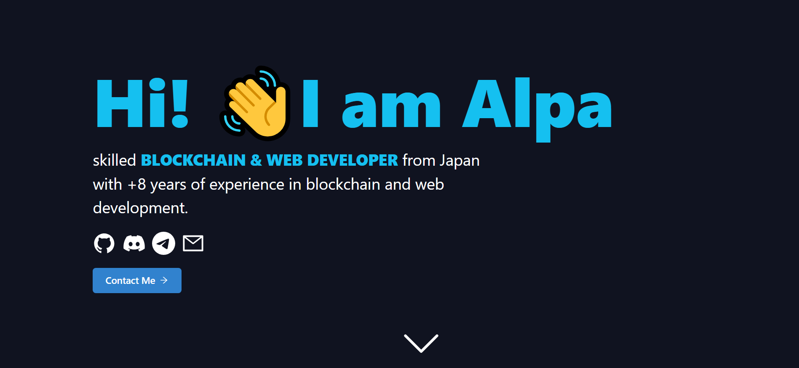

# Portfolio Website
My portfolio website show-casing my skillset, favourite projects and certificates from one of the biggest blockchain academies - Moralis Academy. 

Please leave a ⭐ if you like it.

## Try It Out
My portfolio website is live [here](https://alpa26846.vercel.app/?l=en).

If you find any **errors** ⛔, please report them to [errors@Alpa.dev](mailto:errors@Alpa.dev) thanks 🙏.

## Technologies
For this project I used:
- [React](https://reactjs.org/)
- [TypeScript](https://www.typescriptlang.org/) and [CSS](https://developer.mozilla.org/en-US/docs/Web/CSS)

## About Me
Hi! 👋 I'm Alpa, passionate **blockchain developer** from Slovenia. Take a look at my [portfolio](https://alpa26846.vercel.app/?l=en).

You can get in touch with me through my [website](https://alpa26846.vercel.app/?l=en) or contact me on [discord](https://discord.gg/U5bYk8M9).

## License
[MIT](https://choosealicense.com/licenses/mit/)